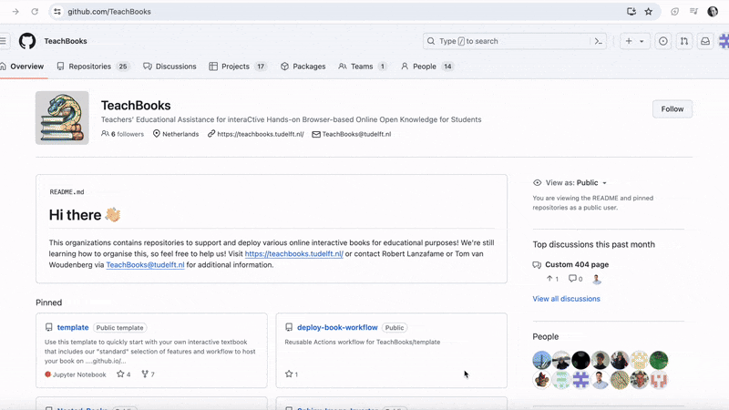
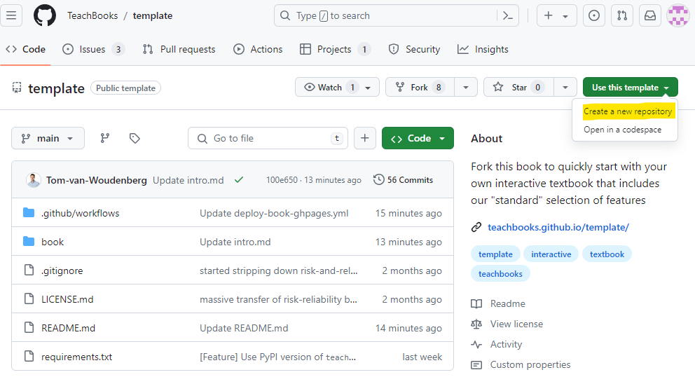
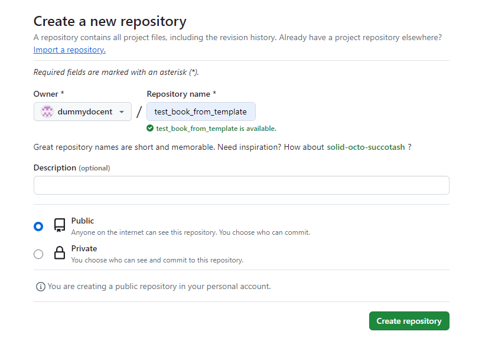
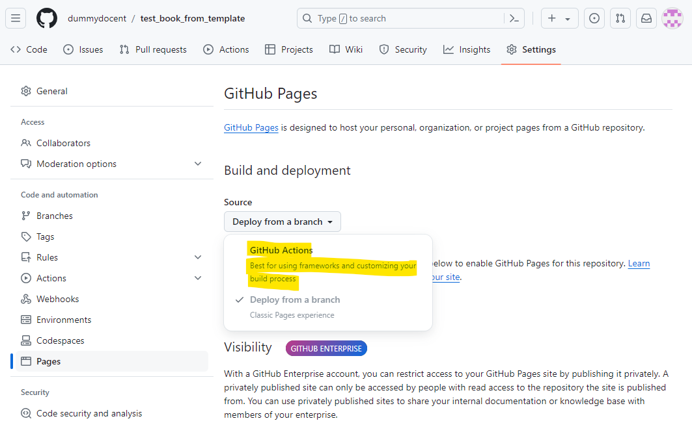
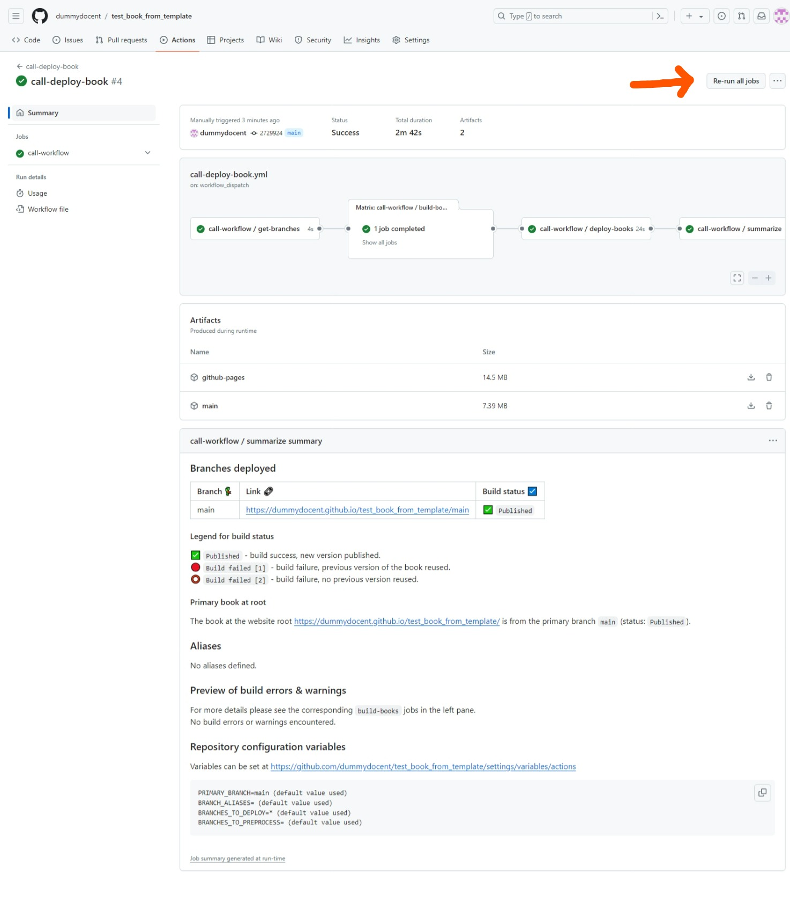
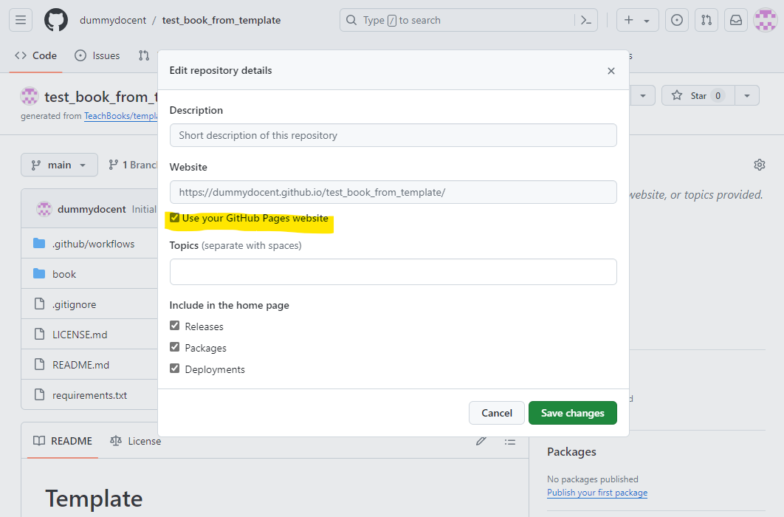

# Welkom bij het TeachBooks template voor het Augustinianum

Met dit template heb je automatisch alle opmaak en paketten om je eigen boek te schrijven.
Het gehele boek wordt automatisch aangemaakt, er zijn slechts enkele stappen nodig om dit werkend te krijgen.

## Hoe maak ik mijn eigen boek?

Video beschikbaar [hier](https://youtu.be/nN3Oi_MVvF0)

1. Om te starten met het maken van een eigen boek, kan je het beste beginnen met het maken van een kopie van dit template:

2. Kies een naam voor de 'repository'. Dit is ook de naam van je boek.

3. Kies voor 'public'

4. You need to activate GitHub pages so that your website is published to the internet. As long as you don't do this your TeachBook is not published online. Actually, now that you've taken this template our workflow tries to publish it to GitHub pages, which you didn't have the chance to activate yet. That's why you probably received an email with 'call-deploy-book: Some jobs were not successful' and you see the failed job under `Initial commit`. You can activate GitHub pages by setting the source for GitHub pages to GitHub Actions under `Settings` - `Pages` - `Build and deployment` - `Source` - `GitHub Actions`:

5. Make an edit to the TeachBook by editing and committing changes to one of the files in the `book/` subdirectory (available under `Code`).  Now checkout the progress of the publishing workflow under `Actions` - `All workflows` -  `call-deploy-book` -`<the most recent workflow run>`. Remember, the first commit which is there has failed because GitHub Pages wasn't activated at the time of `Initial commit`, you could also re-run that job if you don't want to make an edit. You can do so by running the workflow from `Actions` - `All workflows` - `call-deploy-book` - `Initial commit` - `Re-run all jobs` - `Re-run jobs`:

6. When the workflow has finished, visit your build TeachBook at `https://<username or organiszation_name>.github.io/<repository_name>` (case sensitive). For our example it is [https://dummydocent.github.io/test_book_from_template/](https://dummydocent.github.io/test_book_from_template/) for the shown repository. These links are visible in the action's summary as well, as shown in the figure of step 4.

*Extra tip*:
Zet de website voor deze repository gelijk aan de GitHub Pages website via `Code`- `About` - `Settings icon` - `Website` - `Use your GitHub Pages Website`

## Features

- A github repository structure for making a [Jupyter Book](https://github.com/executablebooks/jupyter-book) (`/book`)
- An empty TeachBook containing an intro page on root, an example markdown page, an example jupyter notebook page, an example references page. and an example credits page. (`/book/_toc.yml`, `/book/_config.yml`, `/book/credits.md`, `/book/intro.md`, `/book/references.md`, `/book/some_content/overview.md`, `/book/some_content/text_and_code.ipynb`)
- A file ready for adding references (`references.bib`, `/book/references.md`)
- An example favicon (web browser icon) (`/book/figures/favicon.ico`, `book/_config.yml`.)
- An example logo (`/book/figures/TUDelft_logo_rgb.png`, `/book/config.yml`)
- The configuration files set ready to make your Jupyter Notebooks pages work with [live code using our sphinx-thebe extension](https://teachbooks.io/manual/features/live_code.html) and our recommended settings (`/book/config.yml`)
- An example of setting up preprocessing your table of contents to hide certain draft chapters for eg. students (`_toc.yml`)
- A file containing all the recommended software packages (`requirements.txt`)
- A file containing the recommended license CC BY 4.0 (`LICENSE.md`)
- Our [GitHub workflow for publishing your TeachBook to GitHub Pages](https://github.com/TeachBooks/deploy-book-workflow) (`.github/workflow/call-deploy-book.yml`)
- A gitignore file containing standard python filetype to ignore (`.gitignore`)
- A readme containing information how to use the template, which can adjusted after using the template (`README.md`)

## Vragen

Voor vragen over het gebruik van TeachBooks of over het Template graag mailen naar [G.Dohmen@augustinianum.nl](mailto:g.dohmen@augustinianum.nl).
